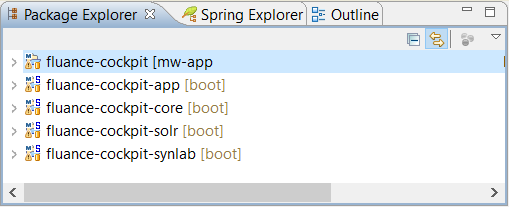

# MW Fluance E-Health Cockpit Application
* [Introduction](#markdown-header-introduction)
* [Getting Started](#markdown-header-getting-started)
	- [Prerequisites](#markdown-header-prerequisites)
	- [Installing](#markdown-header-installing)
* [Development Environment with Docker](#markdown-header-development-environment-with-docker)
	- [Docker Installation](#markdown-header-docker-installation)
	- [Running the Database with Docker](#markdown-header-running-the-database-with-docker)
	- [Running Docker Server with SSL](#markdown-header-running-docker-server-with-ssl)
	- [Running Docker Server without SSL](#markdown-header-running-docker-server-without-ssl)
	- [Testing the Docker Server](#markdown-header-testing-the-docker-server)
* [Configure and Run the Project](#markdown-header-configure-and-run-the-project)
	- [Configure App Base](#markdown-header-configure-app-base)
	- [Configure MW App](#markdown-header-configure-mw-app)
	- [Running the project](markdown-header-running-the-project)
* [Running the tests](#markdown-header-running-the-tests)
	- [Configure the environment](#markdown-header-configure-the-environment)
	- [Endpoint Tests](#markdown-header-endpoint-ests)
	- [Services Tests](#markdown-header-services-tests)
	- [Execute a test](#markdown-header-execute-a-test)
	- [Break down into end to end tests](#markdown-header-break-down-into-end-to-end-tests)
	- [And coding style tests](#markdown-header-and-coding-style-tests)
* [Deployment](#markdown-header-deployment)
* [Built With](#markdown-header-built-with)
* [Contributing](#markdown-header-contributing)
* [Versioning](#markdown-header-versioning)
* [Authors](#markdown-header-authors)
* [License](#markdown-header-license)
* [Acknowledgments](#markdown-header-acknowledgments)

---

## Introduction

Packaged as MW-APP.war (or .jar), **MW Fluance Cockpit Application** is the main MW application of the Fluance EH Cockpit Solution.

It's composed by **4 modules**:

- **fluance-cockpit-app :** contains the Controller, and the service layers.
- **fluance-cockpit-core :** contains the Data Layer (JPA/JDBC repositories, and Models)
- **fluance-cockpit-solr :** a Solr Client Service
- **fluance-cockpit-synlab :** Integration Service with Synlab (Using SOAP)

---

## Getting Started

These instructions will get you a copy of the project up and running on your local machine for development and testing purposes. See deployment for notes on how to deploy the project on a live system.

Get the Project from a Git repository and build it:

```
git pull https://bitbucket.org/fluancedev/mw-app.git
cd mw-app/
mvn clean install -DskipTests
```

Now you can Deploy the war in a tomcat8 or just run it as a spring boot application using STS (Spring tool Suite)

### Prerequisites

- Java 8
- [Maven](https://maven.apache.org/)
- [Git](https://git-scm.com/) version control.
- Access to Fluance Artifactory to load all the necessary packages.
- [Spring Tools Suite - STS](https://spring.io/tools) is recommended as IDE.
- [SourceTree](https://www.sourcetreeapp.com/) Git GUI provided by Atlassian.
- [pgAdmin](https://www.pgadmin.org/) a GUI to manage PostgreSQL Databases

> :exclamation: Be sure that you have the Java SE Development Kit (JDK)

### Installing

MW-APP is using a spring config server to load the right properties with the desired profile. You must set the parameters of the config server in bootstrap.properties or as VM Argument End with an example of getting some data out of the system or using it for a little demo

If you are in the network, go directly to the [configure and Run the Project](#markdown-header-configure-and-run-the-project) section. Otherwise follow reading below.

---

## Development Environment with Docker

If the programmer is **outside of the Fluance Network**, he needs to configure a development environment based on **Docker** in the machine needs a set of configurations to promise a correct runnig.

### Docker Installation

Fluance gives a project which configs a [Docker](https://www.docker.com/) server. The process is described below.

> :exclamation: Need to install the Docker Community Edition for [Mac](https://store.docker.com/editions/community/docker-ce-desktop-mac) or [Windows](https://store.docker.com/editions/community/docker-ce-desktop-windows). After downloaded, follow the Wizard Instructions.

**Clone the project** from the [Docker Spring Config Server](https://bitbucket.org/fluancedev/docker-spring-config-server/src/master/) site.
Next step, the project must be built with the next commands:

```sh
$> cd path_to_docker
$> dir
	Dockerfile
	README.md
## Build command
$> docker build --build-arg version=1.0.0-Mojito-RC --build-arg repoUser=$repoUser --build-arg repoPassword=$repoPwd --no-cache -t config-server-artifactory .
```

Where:

- **$repoUser:** The login name of the developer in the Fluance Git Repository   .
- **$repoPwd:** The pertinent password of the Git user.

> :exclamation: Pay attention to what the Docker server is running 

Once built, it's mandatory login in the Docker session.

```sh
$> docker login --username $fluanceUsername
Password:
```

Where ***$fluanceUsername*** and the ***password*** required must be requested to the MW-Team.

After authenticated, Docker needs a **pull** order and create the network connections.

```sh
$> docker pull fluance/fec:fluance-postgresql-ehealth-developer
   ...
$> docker network create --gateway 10.174.174.1 --subnet 10.174.174.0/24 flunet
```

### Running the Database with Docker

Once the environment is configured, the **local database needs to be started** with the next command in a command console.

```sh
## Local Database init
$> docker run --network flunet --ip 10.174.174.10 -p 45444:45444 -e "USE_VAULT=0" -v data-pgmain:/data/pgdata-main -v data-pglog:/data/pgdata-log -v pgdata:/var/lib/postgresql/9.5/main fluance/fec:fluance-postgresql-ehealth-developer postgres -c config_file=/etc/postgresql/9.5/main/postgresql.conf
```

> :exclamation: The first time, this process takes a few minutes, but the next executions will be very quick.

The next part of running the environment. This depends of the kind of security to managed it. This tutorial takes both approaches into account: **[with SSL](#markdown-header-running-docker-server-with-ssl)** or **[without it](#markdown-header-running-docker-server-without-ssl)**

### Running Docker Server with SSL

First of all, you must request the file the **keystore.jks** to the MW-Team. This one must put it inside a folder which path will be use in the next command line.

```sh
$> docker run -e JAVA_OPTS="-Dspring.cloud.config.server.git.uri=https://bitbucket.org:7990/scm/hpr1m/config-repo -Dspring.cloud.config.server.git.password=$repoPwd -Dspring.cloud.config.server.git.username=$repoUser -Dsecurity.user.password=secret -Dsecurity.basic.enabled=true -Dserver.ssl.key-store=/ssl/keystore.jks -Dserver.ssl.key-alias=localhost" -it -p 8888:8888 -v /c/foo/far\:/ssl config-server-artifactory
```

Where:

- **repoUser:** The login name of the developer in the Fluance Git Repository   
- **repoPwd:** The pertinent password of the Git user
- **/c/foo/far** is the path to the JKS file

> :bulb: On Windows, the classical paths can be turned in an UNIX syntax. For example, the path **C:\foo\bar** can be written like **/c/foo/bar**

Once finished the initialization, it's the moment to test if the server is working properly so [click here](#markdown-header-testing-the-docker-server).

### Running Docker Server without SSL

In the situation the Docker execution cannot load the **keystore.jks**, it can be run with the next parameters.

```sh
$> docker run -e JAVA_OPTS="-Dspring.cloud.config.server.git.uri=https://bitbucket.org:7990/scm/hpr1m/config-repo -Dspring.cloud.config.server.git.password=$repoPwd -Dspring.cloud.config.server.git.username=$repoUser -Dsecurity.user.password=secret -Dsecurity.basic.enabled=true -Dserver.ssl.key-alias=localhost -Dserver.ssl.enabled=false" -it -p 8888:8888 config-server-artifactory
```

Where:

- **repoUser:** The login name of the developer in the Fluance Git Repository   
- **repoPwd:** The pertinent password of the Git user

Once finished the initialization, it's the moment to test if the server is working properly so [click here](#markdown-header-testing-the-docker-server).

### Testing the Docker Server

Once the running process is completed, it's necessary send a Request to the **localhost** using a tool to send REST Requests. In this manual, we use  [Postman](https://www.getpostman.com/)

> :bulb: There are other options as [Restlet Client](https://restlet.com/modules/client/).

The Test Request has the next configuration:

| Field | Value |
| ----- | ----- |
| `Request Type` | Get |
| `URL with SSL` | [https://localhost:8888/mw-app/mojito](https://localhost:8888/mw-app/mojito) |
| `URL without SSL` | [http://localhost:8888/mw-app/mojitoLocal](http://localhost:8888/mw-app/mojitoLocal) |
| `Auth Type` | No Auth |
| `Header Auth Key` | Authorization |
| `Header Auth Value` | **Demand to the MW-Team** |


---


---


> :exclamation: The end of the URL describes the **profile** which the Request uses to manage all the process

The answer to this request is a JSON message with an schema similar like next one:

```JSON
{
	"name": "mw-app",
	"profiles": [
		"mojitoLocal"
	],
	"label": null,
	"version": null,
	"state": null,
	"propertySources": [
	]
}
```

---

## Configure and Run the Project

### Configure App Base

Firstly, you need to **clone** the **[App-Base](https://bitbucket.org:7990/projects/HPR1M/repos/app-base/browse)** project in the workspace you're going to work using **SourceTree**.

From this GUI, select **File --> Clone / New** and a form is opened in a new tab. Fill the fields with the next information

| Field | Value |
| ----- | ----- |
| `Source Path` | The HTTP address to clone the project given by the Repository Site. |
| `Destination Path` | The workspace path with the name of the project |
| `Name` | The name of the project |
| `Checkout branch` | develop |


And push the **Clone** button.

Once cloned, open the **STS IDE** using the workspace created. At this moment you need to **Import** the **App-Base** project as a Maven Project. For that:

#### Step 1:
Go to **File --> Import...** 

#### Step 2:
In the new window, select the **Existing Maven Projects** import wizard and push **Next**


#### Step 3: 
In the new fields, fill the **Root Directory** with the same destination path espefified in the Clone Project Tab and in the below space you will see the available projects.


#### Step 4: 
Click **Finish** and the App-Base will be imported into the IDE.

> :exclamation:	When you begin to work in some issue, there will be a new branch from **develop** to make the necessary implementation. So you'll must checkout to this branch before begin program. From STS, right-click over the project, **Team --> Switch to... --> Other...** and look for the Remote branch.

#### Step 5: 
Finally, Maven must be run to build the project. It could be done from a terminal with the next commands

```sh
$> cd $path_to_workspace/app-base
$> mvn clean install
```

Or you can use the Eclipse Configurations creating a **Maven Build** with the next info:


> :exclamation: In the Eclipse execution, be sure it's used the JDK as Runtime. Otherwise, if uses the JRE, the *Maven Build* will fail.


### Configure MW App

It's the moment to **clone** the **[MW-APP](https://bitbucket.org:7990/projects/HPR1M/repos/mw-app/browse)** project in the workspace you're going to work using **SourceTree**.

From this GUI, select **File --> Clone / New** and a form is opened in a new tab. Fill the fields with the next information

| Field | Value |
| ----- | ----- |
| `Source Path` | The HTTP address to clone the project given by the Repository Site. |
| `Destination Path` | The same workspace path of the **App-Base** |
| `Name` | The name of the project: **mw-app** |
| `Checkout branch` | develop |


And push the **Clone** button.

Once cloned, open the **STS IDE** using the workspace created. At this moment you need to **Import** the **App-Base** project as a Maven Project. For that:

#### Step 1:
Go to **File --> Import...** 
#### Step 2:
In the new window, select the **Existing Maven Projects** import wizard and push **Next**


#### Step 3:
In the new fields, fill the **Root Directory** with the same destination path espefified in the Clone Project Tab and in the below space you will see the available projects.


#### Step 4:

Click **Finish** and the **Mw-App** will be imported into the IDE.

> :exclamation:	When you begin to work in some issue, there will be a new branch from **develop** to make the necessary implementation. So you'll must checkout to this branch before begin program. From STS, right-click over the project, **Team --> Switch to... --> Other...** and look for the Remote branch.



#### Step 5:
Finally, Maven must be run to build the project. It could be done from a terminal with the next commands

```sh
$> cd $path_to_workspace/mw-app
$> mvn clean install
```

Or you can use the Eclipse Configurations creating a **Maven Build** with the next info:


> :exclamation: In the Eclipse execution, be sure it's used the JDK as Runtime. Otherwise, if uses the JRE, the *Maven Build* will fail.


### Running the project

Once compiled all the necessary elements, it's time to run the application on a server.

#### Step 1:

In the Eclipse **Run Configurations** create a new **Spring Boot App**. 

> :exclamation: Depending on whether you work with the SSL protocol or not, the configuration is different.

#### Step 2a: Configure Launch Server with SSL

This step configures the launch server with a SSL environment. If you are working without it, go to [Step 2b](#markdown-header-step-2b-configure-launch-server-without-ssl).

In the **Spring Boot** tab, the value of the fields are the next ones:

| Field | Value |
| ----- | ----- |
| `Project` | fluance-cockpit-app |
| `Main Type` | net.fluance.cockpit.app.Application |
| `Profile` | mojito |


And in the **Arguments** tab, the **VM arguments** must have the next value

```sh
-Djavax.net.ssl.trustStoreType=JKS -Djavax.net.ssl.trustStorePassword=fluance -Djavax.net.ssl.trustStore="C:\...\truststore.jks" -Dspring.cloud.config.username=admin -Dspring.cloud.config.password=secret -Dspring.cloud.config.uri=https://localhost:8888 -Dspring.application.name=mw-app -Dspring.profiles.active=mojito
```

Where the **truststore.jks** must be solicited to the MW-Team.


Finally, click over the **Apply** button and go to [the next step](#markdown-header-step-3)

#### Step 2b: Configure Launch Server without SSL

This step configures the launch server without a SSL environment. If you are working with it, go to [Step 2a](#markdown-header-step-2a).

In the **Spring Boot** tab, the value of the fields are the next ones:

| Field | Value |
| ----- | ----- |
| `Project` | fluance-cockpit-app |
| `Main Type` | net.fluance.cockpit.app.Application |
| `Profile` | mojitoLocal |


And in the **Arguments** tab, the **VM arguments** must have the next value

```sh
-Djavax.net.ssl.trustStoreType=JKS -Djavax.net.ssl.trustStorePassword=fluance -Djavax.net.ssl.trustStore="C:\...\truststore.jks" -Dspring.cloud.config.username=admin -Dspring.cloud.config.password=secret -Dspring.cloud.config.uri=http://localhost:8888 -Dspring.application.name=mw-app -Dspring.profiles.active=mojitoLocal
```

Where the **truststore.jks** must be solicited to the MW-Team.


Click over the **Apply** button and open the **bootstrap.properties** file. The content of the file must be changed with the next content.

```INI
spring.cloud.config.uri=http://localhost:8888
spring.cloud.config.username=admin
spring.cloud.config.password=secret
spring.application.name=mw-app
spring.profiles.active=mojitoLocal
server.ssl.enabled=false
```

> :exclamation: This file **never must be pushed on Git**. It only changes if there a notification by the MW-Team.

Once configured the Launch Server, it's time to run first time. In that moment, you'll get the next error in console

```s
2017-08-07 17:15:36 ERROR SpringApplication:815 - Application startup failed
Error creating bean with name 'entityManagerFactory' defined in class path resource [org/springframework/boot/autoconfigure/orm/jpa/HibernateJpaAutoConfiguration.class]: Invocation of init method failed; nested exception is org.hibernate.HibernateException: Missing table: patientslist
...
```

The error is due to the absence of a table in the local database. To correct it first create a **new Connection Profile in the pgAdmin** with the next info

| Field | Value |
| ----- | ----- |
| `HOST` | localhost |
| `PORT` | 45444 |
| `username` | postgres |
| `password` | postgres |
| `name` | Put what you want (e.g. localDockerDB) |


Go to the **granulaoperate database** and the **ehealth** schema.


And execute the next script:

```SQL
CREATE TABLE patientslistconfig (
	company_id integer NOT NULL,
	unit character varying(255) NOT NULL,
	room character varying(255) NOT NULL,
	bed character varying(255) NOT NULL,
	sortorder integer,
	
	CONSTRAINT patientslistconfig_pkey 
		PRIMARY KEY (company_id, unit, room, bed),
	CONSTRAINT fk_plc_com
		FOREIGN KEY (company_id)
		REFERENCES company (id) MATCH SIMPLE
		ON UPDATE CASCADE ON DELETE RESTRICT
)
WITH (
	OIDS=FALSE
);

ALTER TABLE patientslistconfig
	OWNER TO fluance;
GRANT ALL
	ON TABLE patientslistconfig
	TO fluance;
GRANT SELECT, UPDATE, INSERT, DELETE
	ON TABLE patientslistconfig 
	TO dbinput;
GRANT SELECT, UPDATE, INSERT, DELETE
	ON TABLE patientslistconfig 
	TO leech;

CREATE TABLE patientslistdata (
	visit_nb bigint NOT NULL,
	food character varying(255),
	mobility character varying(255),
	
	CONSTRAINT patientslistdata_pkey 
		PRIMARY KEY (visit_nb),
	CONSTRAINT fk_pld_vis
		FOREIGN KEY (visit_nb)
		REFERENCES visit (nb) MATCH SIMPLE
		ON UPDATE CASCADE ON DELETE RESTRICT
)
WITH (
	OIDS=FALSE
);

ALTER TABLE patientslistdata
	OWNER TO fluance;
GRANT ALL
	ON TABLE patientslistdata
	TO fluance;
GRANT SELECT, UPDATE, INSERT, DELETE
	ON TABLE patientslistdata
	TO dbinput;
GRANT SELECT, UPDATE, INSERT, DELETE
	ON TABLE patientslistdata
	TO leech;

CREATE TABLE patientslist (
	id bigserial NOT NULL,
	company_id integer NOT NULL,
	unit character varying(255) NOT NULL,
	listdate date,
	shiftleader character varying(255) NOT NULL,
	
	CONSTRAINT patientslist_pkey 
		PRIMARY KEY (id),
	CONSTRAINT fk_pl_com 
		FOREIGN KEY (company_id)
		REFERENCES company (id) MATCH SIMPLE
		ON UPDATE CASCADE ON DELETE RESTRICT
)
WITH (
	OIDS=FALSE
);

ALTER TABLE patientslist
	OWNER TO fluance;
GRANT ALL 
	ON TABLE patientslist
	TO fluance;
GRANT SELECT, UPDATE, INSERT, DELETE
	ON TABLE patientslist
	TO dbinput;
GRANT SELECT, UPDATE, INSERT, DELETE 
	ON TABLE patientslist
	TO leech;

-- Index: fki_pl_com_un
-- DROP INDEX fki_pl_com_un;

CREATE INDEX fki_pl_com_un
	ON patientslist
	USING btree (
		company_id, unit COLLATE pg_catalog."default"
	);
```
In this point, reboot the App.

#### Step 3:

When the boot will be finished, the user can test one of the next URL with the **Postman**: 

* If your are using SSL, https://localhost:8080/mw-app/companies,
* Or without SSL http://localhost:8080/mw-app/companies

And you need an **Auth Token** too. To get it, you must:

1. Access at the http://mojito.dev.fluance.net:8080/lab-ui/saml/login site
2. Select **SAML OAuth2 login**
3. Login with a valid FEHC user which must be request to the MW-Team
4. The web will return an authorized token and its type.


If the application has been launched correctly, the answer wil be the next one


---

## Running the tests

The tests verify all the services of the application, their different contexts, their different answers and the treatment of the same ones.

>:exclamation: The tests must be executed without any server running and as independent of the database as possible.

To achieve this scenario, the test are based on [Mocks](https://en.wikipedia.org/wiki/Mock_object) to give to give developers maximum independence when working with methods that are only declared but not implemented at the time of test construction.

### Configure the environment

Before launch the test, there is a PROPERTIES file (**application.properties**) which contains a set of values:

| Name | Value |
| ----- | ----- |
| `server.context-path` | /mw-app |
| `server.ssl.enabled` | false |
| `server.port` | 8080 |
| |
| `app.version` | 2.0.0 |
| `app.header.version` | x-api-version |
| `app.header.from-public-network` | x-request-from-internet |
| |
| `test.server.host` | `http://localhost:` |
| `test.server.port` | 8080 |
| `test.server.context-path` | /mw-app |
| |
| `test.swagger.host` | `http://mojito.dev.fluance.net:` |
| `test.swagger.port` | 8080 |
| `test.swagger.context-path` | /mw-app/v2/api-docs |
| |
| `logging.level.net.fluance.cockpit` | DEBUG |
| |
| `spring.jpa.show-sql` | true |

### Endpoint Tests

This type of test is responsible for checking the behavior of **REST services** against the different responses of the server and if these are expected.

### Services Tests

This kind of test emules different status of the fields used in a Service and it checks if the answer is correct.

### Execute a test

Firstly, you need to locate the **Java Class** you want execute in the `src/test/java`. Once done, exetute in **Debug mode** and **STS** will show the Result Resport. All the test answers which uses a Service must be correct to validate it as correct.


### Break down into end to end tests

TODO

### And coding style tests

TODO

## Deployment

TODO

## Built With

- [Dropwizard](http://www.dropwizard.io/1.0.2/docs/) - The web framework used
- [Maven](https://maven.apache.org/) - Dependency Management
- [ROME](https://rometools.github.io/rome/) - Used to generate RSS Feeds

## Contributing

..... TODO

## Versioning

We use [SemVer](http://semver.org/) for versioning. For the versions available, see the [tags on this repository](https://github.com/your/project/tags).

## Acknowledgments

- Hat tip to anyone who's code was used
- Inspiration
- etc
